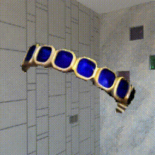
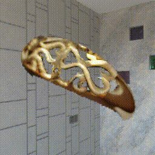
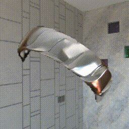

# Relighting Any Jewelry via Diffusion 

## [Input](What you need to prepare)
### Jewelry Image
### HDR

## [Output](What you expect to get)
### Relit Jewelry Image

## [Preview](gifs)

<p float="left">
  
  

  
  
</p>

<p float="left">
  
  

  
  
</p>

<p float="left">
  
  

  
  
</p>


<p float="left">
  
  

  
  
</p>

<p float="left">
  
  

  
  
</p>


<p float="left">
  
  

  
  
</p>


<p float="left">
  
  

  
  
</p>

<p float="left">
  
  

  
  
</p>

<p float="left">
  
  

  
  
</p>

<p float="left">
  
  

  
  
</p>


## 1. Preparation 
### 1.1 Installation
```bash
conda create -n relight python=3.9
conda activate relight 
pip install -r requirements.txt

pip3 install -U xformers==0.0.28 --index-url https://download.pytorch.org/whl/cu118
```
### 1.2 Downloading the checkpoint
The checkpoint file will be saved in the `./log/training` folder.  
Download checkpoints here: https://drive.google.com/drive/folders/1KFL9mRVyD2XO26y6tEOllO_-iY_W7zcC?usp=sharing  
Unzip training.zip: your project dir/logs/training/checkpoint-160000...  


Download this checkpoints here: https://huggingface.co/kxic/zero123-165000/tree/main  
Put all the files under the directory pretrained: your project dir/pretrained/zero123-165000  

## 3. Inference commands 
### 3.1 Relighting in-the-wild single image input
All the scripts you need to run are:  
```bash
sh segment.sh
sh preporcessHdr.sh
sh inference.sh
sh composite.sh
```
Replace all the dir location to your local dir.  
#### 3.1.1 Image preprocessing: segment, rescale, and recenter
Put the input images under the `--img_dir` folder and run the following command to segment the foreground.  
The preprocessed data will be saved in `--out_dir`.  

Here, we borrow code from One-2-3-45.

*Note: If you input images have masks and you don't want to do rescale and recenter, you can skip this step by manually saving the three-channel foreground and mask of each input image in the `{$out_dir}/img` and `{$out_dir}/mask` folders, respectively.*

- `--out_dir`: this is your expected segmented output dir.  
```bash
# download the pre-trained SAM to segment the foreground
# only need to run once
cd models/checkpoints
wget https://dl.fbaipublicfiles.com/segment_anything/sam_vit_h_4b8939.pth
cd ../..

#################################################################

# Segment the foreground
sh segment.sh
# The preprocessed data will be saved in ./'preprocessed_data'
```

#### 3.1.2 Preprocessing the target environment maps
Place the target environment maps in the `--lighting_dir` folder, then run the following command to preprocess them. The preprocessed data will be saved in the `--output_dir `folder. Use `--frame_num` to specify the number of frames for rotating the environment maps 360 degrees along the azimuthal direction. 
- `--lighting_dir`: this is where you put your original hdr files.  
- `--output_dir`: this is your expected processed hdr dir.  
```bash
sh preporcessHdr.sh
```
#### 3.1.3 Relighting
The following command relights the input images stored in the `--validataion_data_dir` folder using preprocessed target lighting data from the `--lighting_dir`. The relighted images will be saved in the `--save_dir` folder. The checkpoint file for the diffusion model is located in the `--output_dir` folder.

In total, this command will generate 2,400 relighted images ($5 \text{ input images} \times 4 \text{ different lighting conditions} \times 120 \text{ rotations per lighting}$). 
- `--save_dir`: this is your relit output dir.  
- `--val_img_dir`: your preprocessed image dir.  
- `--val_lighting_dir`: your preprocessed hdr dir.  
```bash
sh inference.sh
```

#### 3.1.4 Compositing the background (optional)

- `--mask_dir`: your preprocessed image mask dir.  
- `--lighting_dir`: your preprocessed hdr dir.  
- `--relighting_dir`: relit output dir.  
- `--save_dir`: video output dir. 
```bash
sh composite.sh
```


<!-- 


 -->
